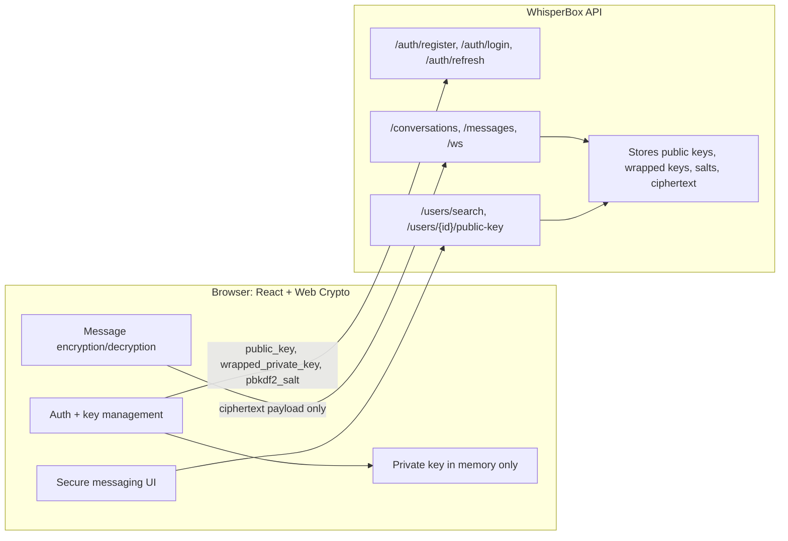

# WhisperBox

WhisperBox is an end-to-end encrypted messaging client built for the
WhisperBox API at `https://whisperbox.koyeb.app`.

All encryption and decryption happens in the browser with the Web Crypto API.
The backend only stores authentication data, public keys, wrapped private-key
blobs, and encrypted message payloads.

## Architecture



## Encryption Flow

Hybrid encryption is used for each message:

1. Generate a fresh 256-bit AES-GCM key and a fresh 96-bit IV.
2. Encrypt plaintext with AES-GCM to produce `ciphertext`.
3. Encrypt the AES key with the recipient's RSA-OAEP public key as `encryptedKey`.
4. Encrypt the same AES key with the sender's RSA-OAEP public key as `encryptedKeyForSelf`.
5. Send `{ ciphertext, iv, encryptedKey, encryptedKeyForSelf }` through WebSocket or the REST fallback.

Receiving works in reverse:

1. Use the in-memory RSA-OAEP private key to decrypt the relevant encrypted AES key.
2. Import the decrypted AES key for AES-GCM.
3. Decrypt the ciphertext using the AES key and IV.
4. If AES-GCM authentication fails, the UI shows `Could not decrypt this message`.

Implementation: `src/lib/crypto.ts`.

## Key Management

### Registration

1. The browser generates an RSA-OAEP 2048-bit keypair.
2. The browser generates a random 128-bit PBKDF2 salt.
3. PBKDF2-SHA256 derives an AES-KW wrapping key from the user's password and salt.
4. The private key is wrapped with AES-KW.
5. The public key, wrapped private key, and salt are sent to `/auth/register`.

### Login and Unlock

1. `/auth/login` returns tokens plus `wrapped_private_key` and `pbkdf2_salt`.
2. The password and salt re-derive the AES-KW wrapping key.
3. `crypto.subtle.unwrapKey` unwraps the RSA private key as a non-extractable `CryptoKey`.
4. The unwrapped private key is kept in memory only and cleared on reload or logout.

| Material | Location | Persistence |
| --- | --- | --- |
| Public key | Backend and memory | Persistent on backend |
| Wrapped private key | Backend | Persistent on backend |
| PBKDF2 salt | Backend | Persistent on backend |
| Unwrapped private key | Non-extractable `CryptoKey` in memory | Cleared on reload/logout |
| Access token | Memory | Cleared on reload |
| Refresh token | `sessionStorage` | Cleared when tab session ends |
| Plaintext messages | Memory after decryption | Never persisted by the app |

No sensitive data is stored in `localStorage`.

## Security Properties

- Server cannot read message content because message bodies are ciphertext.
- Private keys never leave the client unwrapped.
- Unwrapped private keys are non-extractable.
- Each message uses a fresh AES-GCM key and IV.
- AES-GCM authentication detects ciphertext tampering.
- Access tokens are refreshed through the API and WebSocket reconnects use fresh tokens.
- WebSocket delivery is preferred, with `/messages` used when the socket is offline.
- Usernames and password lengths are validated before auth requests.

## Trade-offs and Known Limitations

- No forward secrecy. Long-term RSA-OAEP keys can decrypt historical messages if the wrapped key and password are compromised.
- Trust on first use. Peer public keys are fetched from the server and shown with a fingerprint, but fingerprints are not pinned across sessions.
- Metadata is not encrypted. The server still sees sender, recipient, timestamps, and payload sizes.
- Replay protection is limited to client-side message ID de-duplication.
- Password recovery is intentionally unavailable because the password protects the wrapped private key.
- The user must unlock the private key again after reload.

## API Coverage

| Feature | Endpoint |
| --- | --- |
| Register | `POST /auth/register` |
| Login | `POST /auth/login` |
| Restore profile | `GET /auth/me` |
| Refresh access token | `POST /auth/refresh` |
| Logout | `POST /auth/logout` |
| Search users | `GET /users/search?q=` |
| Fetch public key | `GET /users/{id}/public-key` |
| Conversations | `GET /conversations` |
| Message history | `GET /conversations/{id}/messages` |
| Offline send fallback | `POST /messages` |
| Real-time messages | `WS /ws?token=` |

## Tech Stack

- React 19 + Vite + TypeScript
- Tailwind CSS + shadcn/ui primitives
- Lucide icons
- Web Crypto API
- WhisperBox REST and WebSocket backend

## Source Map

| Path | Purpose |
| --- | --- |
| `src/lib/crypto.ts` | Web Crypto operations |
| `src/lib/api.ts` | REST client and token refresh |
| `src/lib/ws.ts` | WebSocket client with reconnect |
| `src/lib/session.ts` | In-memory private-key holder |
| `src/contexts/AuthContext.tsx` | Auth and key lifecycle |
| `src/components/AuthCard.tsx` | Login, register, unlock UI |
| `src/components/ConversationsSidebar.tsx` | Conversations and user search |
| `src/components/ChatThread.tsx` | Message history, decryption, composer |
| `src/pages/Index.tsx` | Responsive app shell |

## Running Locally

```bash
npm install
npm run dev
```

Build verification:

```bash
npm run build
```

## Author

Racheal I. Ogunmodede (TechNurse)
